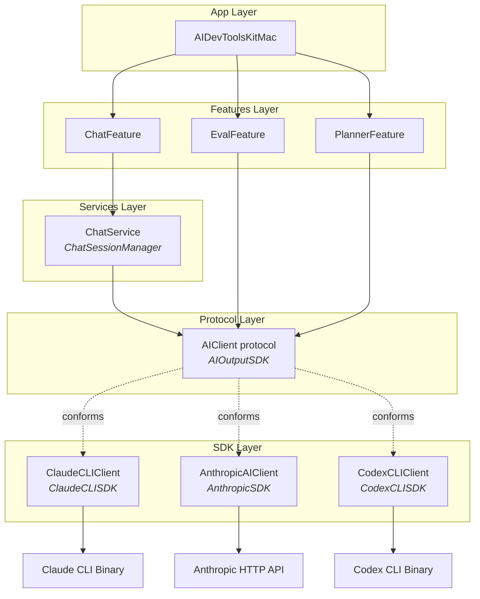

## Relevant Skills

| Skill | Description |
|-------|-------------|
| `swift-architecture` | 4-layer Swift app architecture (Apps, Features, Services, SDKs) |
| `ai-dev-tools-debug` | File paths, CLI commands, and artifact structure for AIDevTools |

## Background

The previous spec (2026-03-25-c) unified evals, architecture planner, and plan runner behind the `AIClient` protocol and `AIRunSession`. But the project has **two entirely separate chat systems** that bypass this interface:

| Chat system | Stack | Multi-turn | Streaming | Persistence |
|-------------|-------|-----------|-----------|-------------|
| **ClaudeCodeChat** | `ClaudeCLIClient` directly → Claude CLI binary | `--resume <sessionId>` (server-managed) | Callback `onFormattedOutput` | JSONL files in `~/.claude/projects/` |
| **AnthropicChat** | `AnthropicAPIClient` → Anthropic HTTP API | Message array history (client-managed) | `AsyncStream<ChatEvent>` | SwiftData (`ChatConversation` / `ChatMessage`) |

Neither chat system uses `AIClient` or `AIRunSession`. They each have their own SDK, service, feature, and app-layer code with no shared abstraction.

### Current module dependency paths

```
ClaudeCodeChat:  App → ClaudeCodeChatFeature → ClaudeCodeChatService → ClaudeCLISDK
AnthropicChat:   App → AnthropicChatFeature → AnthropicChatService → AnthropicSDK → SwiftAnthropic
Evals/Planner:   App → Feature → AIClient (protocol in AIOutputSDK) → ClaudeCLISDK or CodexCLISDK
```

### Goal

Extend `AIClient` with conversation support so chat, evals, and architecture planning all go through the same protocol. Create an `AnthropicAPIClient` conformance to `AIClient`. Then build a unified chat service on top of `AIClient` that replaces both `ClaudeCodeChatService` and `AnthropicChatService`.

### Target module dependency path

```
Chat:            App → ChatFeature → ChatService → AIClient (protocol in AIOutputSDK) → any conforming SDK
Evals/Planner:   App → Feature → AIClient (protocol in AIOutputSDK) → any conforming SDK
```

### Proposed architecture



### Key design challenge: two multi-turn paradigms

- **CLI-based** (Claude CLI): conversation history lives server-side. Client resumes via `--resume <sessionId>`. The CLI returns a session ID in its JSONL stream output.
- **API-based** (Anthropic API): conversation history lives client-side. Each request sends the full message array. There is no server-side session.

The solution: `AIClient` gains optional `sessionId` in options/results. Each conformance handles multi-turn internally:
- `ClaudeCLIClient`: maps `sessionId` to `--resume` flag
- `AnthropicAIClient` (new adapter): maintains an internal conversation history dictionary keyed by `sessionId`, sends full message array with each request

Callers see a uniform interface. Single-shot callers (evals, planner) ignore `sessionId`. Chat callers pass it for multi-turn.

## Phases

## - [x] Phase 1: Extend AIClient protocol with conversation support

**Skills used**: `swift-architecture`
**Principles applied**: All new fields use optional parameters with nil defaults — additive change with zero impact on existing callers

**Skills to read**: `swift-architecture`

Add session/conversation fields to the existing types in `AIOutputSDK`. This is additive — all existing callers continue to work because new fields have defaults.

### Changes to `AIClientOptions`

```swift
public struct AIClientOptions: Sendable {
    // Existing
    public var dangerouslySkipPermissions: Bool
    public var environment: [String: String]?
    public var jsonSchema: String?
    public var model: String?
    public var workingDirectory: String?
    // New
    public var sessionId: String?           // Resume a prior conversation
    public var systemPrompt: String?        // System-level instruction
}
```

### Changes to `AIClientResult`

```swift
public struct AIClientResult: Sendable {
    // Existing
    public let exitCode: Int32
    public let stderr: String
    public let stdout: String
    // New
    public let sessionId: String?           // Session ID for future resume
}
```

### Changes to `AIStructuredResult`

```swift
public struct AIStructuredResult<T: Sendable>: Sendable {
    // Existing
    public let rawOutput: String
    public let stderr: String
    public let value: T
    // New
    public let sessionId: String?
}
```

### Design notes

- All new fields are optional with `nil` defaults — no breaking changes to existing callers
- `systemPrompt` is needed for chat (both CLI and API support it) and could benefit evals in the future
- `sessionId` in result lets callers track which session was created/resumed without parsing CLI output

### Tasks

- Add `sessionId` and `systemPrompt` to `AIClientOptions` init
- Add `sessionId` to `AIClientResult` and `AIStructuredResult` inits
- Update `AIRunSession.run()` and `runStructured()` to pass through and return `sessionId`
- Verify all existing callers still compile (they pass no `sessionId`, so they get `nil`)

## - [x] Phase 2: Update CLI conformances and create Anthropic adapter

**Skills used**: `swift-architecture`
**Principles applied**: SDKs are stateless structs (ClaudeCLI/Codex); AnthropicAIClient is an actor because it manages conversation state. Codex left unchanged since it doesn't support resume/system-prompt.

**Skills to read**: `swift-architecture`

Update existing `ClaudeCLIClient` and `CodexCLIClient` conformances to handle the new fields. Create a new `AnthropicAIClient` adapter that conforms `AnthropicAPIClient` to `AIClient`.

### ClaudeCLIClient conformance updates

In `ClaudeCLIClient+AIClient.swift`:
- Map `options.sessionId` → `command.resume = sessionId`
- Map `options.systemPrompt` → `command.systemPrompt` (if Claude CLI supports it; otherwise skip)
- Extract `sessionId` from CLI JSONL output and populate `AIClientResult.sessionId`
  - `ClaudeCLIClient` already has `extractSessionId(from:)` — reuse it
- Pass `sessionId` through in `AIStructuredResult` as well

### CodexCLIClient conformance updates

Same pattern. If Codex CLI doesn't support `--resume`, set `sessionId = nil` in results.

### New: AnthropicAIClient adapter

Add `AIOutputSDK` as a dependency of `AnthropicSDK` in Package.swift. Create a new file `AnthropicSDK/AnthropicAIClient.swift`:

```swift
public actor AnthropicAIClient: AIClient {
    private let apiClient: AnthropicAPIClient
    private var conversations: [String: [MessageParameter.Message]] = [:]

    public init(apiClient: AnthropicAPIClient) { ... }

    public func run(
        prompt: String,
        options: AIClientOptions,
        onOutput: (@Sendable (String) -> Void)?
    ) async throws -> AIClientResult {
        let sessionId = options.sessionId ?? UUID().uuidString
        let history = conversations[sessionId] ?? []

        // Build MessageParameter with history + new user message
        // Stream response via apiClient.streamMessage()
        // Call onOutput for each text chunk
        // Accumulate full response text
        // Append user + assistant messages to conversations[sessionId]

        return AIClientResult(
            exitCode: 0,
            stderr: "",
            stdout: fullResponseText,
            sessionId: sessionId
        )
    }

    public func runStructured<T: Decodable & Sendable>(
        _ type: T.Type,
        prompt: String,
        jsonSchema: String,
        options: AIClientOptions,
        onOutput: (@Sendable (String) -> Void)?
    ) async throws -> AIStructuredResult<T> {
        // Similar to run(), but parse JSON from response
        // Use jsonSchema in prompt instruction (Anthropic API doesn't have native JSON schema like Claude CLI)
    }
}
```

### Design notes

- `AnthropicAIClient` is an **actor** (stateful, manages conversation histories) — `AIClient` requires `Sendable`, which actors satisfy
- `exitCode = 0` and `stderr = ""` for successful API calls is pragmatic — these are CLI concepts that API callers don't use. On API error, throw rather than returning a non-zero exit code.
- Conversation history is in-memory. If the actor is deallocated, history is lost. This is acceptable because persistence happens at a higher layer (chat service / SwiftData). The actor's history is just for building correct API requests within a session lifetime.
- `runStructured` for API: embed the JSON schema in the prompt instruction and parse the response. Unlike Claude CLI which has native `--json-schema`, the API requires prompt-based schema guidance.

### Tasks

- Update `ClaudeCLIClient+AIClient.swift` — sessionId passthrough + extraction
- Update `CodexCLIClient+AIClient.swift` — sessionId passthrough
- Add `AIOutputSDK` dependency to `AnthropicSDK` target in Package.swift
- Create `AnthropicAIClient.swift` in `AnthropicSDK`
- Unit tests:
  - CLI conformance passes `--resume` when sessionId provided
  - CLI conformance extracts sessionId from result
  - AnthropicAIClient sends message history on second call with same sessionId
  - AnthropicAIClient generates new sessionId when none provided

## - [x] Phase 3: Create unified ChatService on AIClient

**Skills used**: `swift-architecture`
**Principles applied**: Services layer holds shared stateful types; ChatService depends only on AIOutputSDK protocol, no concrete SDKs; persistence stays at App layer

**Skills to read**: `swift-architecture`

Create a new `ChatService` module (Services layer) that manages conversations through `AIClient`. This service replaces the conversation/session management currently split across `ClaudeCodeChatManager`, `ChatStreamingService`, `ChatOrchestrator`, and `ConversationManager`.

### New module: `ChatService`

Dependencies: `AIOutputSDK` only (uses `AIClient` protocol, not any concrete SDK).

### Core types

```swift
/// A single message in a conversation
public struct ChatMessageRecord: Sendable, Identifiable {
    public let id: UUID
    public let content: String
    public let isUser: Bool
    public let timestamp: Date
}

/// Represents an active or historical conversation
public struct Conversation: Sendable, Identifiable {
    public let id: UUID
    public var title: String?
    public var messages: [ChatMessageRecord]
    public var sessionId: String?   // AIClient session ID for resume
    public let createdDate: Date
    public var lastModifiedDate: Date
}

/// Events emitted during streaming
public enum ChatStreamEvent: Sendable {
    case textDelta(String)
    case completed(fullText: String)
    case error(Error)
}
```

### ChatSessionManager

```swift
/// Manages chat conversations through any AIClient
public actor ChatSessionManager {
    private let client: any AIClient
    private var conversations: [UUID: Conversation] = [:]

    public init(client: any AIClient)

    /// Send a message in a conversation, streaming the response
    public func send(
        message: String,
        conversationId: UUID,
        options: AIClientOptions,
        onEvent: @Sendable (ChatStreamEvent) -> Void
    ) async throws

    /// Create a new conversation
    public func createConversation() -> Conversation

    /// Load a conversation (from in-memory cache)
    public func conversation(id: UUID) -> Conversation?

    /// List all conversations
    public func allConversations() -> [Conversation]
}
```

### Behavior

- `send()` appends the user message to the conversation, calls `client.run(prompt:options:onOutput:)` with the conversation's `sessionId`, streams via `onEvent`, appends the assistant response, and updates the conversation's `sessionId` from the result
- For CLI-backed clients: `sessionId` handles multi-turn. The conversation's message list is for UI display only.
- For API-backed clients: `sessionId` routes to the adapter's internal history. The conversation's message list is also for UI display.
- Persistence (SwiftData, disk, etc.) is NOT in this service — that responsibility stays at the App layer or a separate persistence service. `ChatSessionManager` is in-memory only.

### Design notes

- This is a **Services layer** module — it holds shared stateful types but doesn't orchestrate multi-step features
- No dependency on `ClaudeCLISDK`, `AnthropicSDK`, or `SwiftAnthropic` — purely protocol-driven
- The `ChatStreamEvent` enum is simpler than the existing `ChatEvent` (no toolUse/toolResult). Tool calling can be added later as an `AIClient` extension.
- `ChatMessageRecord` is a plain value type, not a SwiftData `@Model`. The App layer maps these to/from its persistence model.

### Tasks

- Add `ChatService` target to Package.swift with `AIOutputSDK` dependency
- Create `ChatMessageRecord.swift`, `Conversation.swift`, `ChatStreamEvent.swift`
- Create `ChatSessionManager.swift`
- Unit tests with a mock `AIClient`:
  - Creating a conversation and sending a message
  - Multi-turn: second message passes sessionId from first response
  - Streaming events arrive in correct order
  - Error propagation

## - [x] Phase 4: Migrate ClaudeCodeChat to unified ChatService

**Skills used**: `swift-architecture`, `ai-dev-tools-debug`
**Principles applied**: Concrete SDK injected at App layer; service and feature layers depend only on AIClient protocol via AIOutputSDK. JSONL session loading stays in ClaudeCodeChatService as CLI-specific utility.

**Skills to read**: `swift-architecture`, `ai-dev-tools-debug`

Replace `ClaudeCodeChatManager`'s direct `ClaudeCLIClient` usage with `ChatSessionManager` + `AIClient`.

### Current flow

```
ClaudeCodeChatManager → ClaudeCLIClient.run(command:) → Claude CLI
  - Manually builds Claude command
  - Manages sessionState.messages in-memory
  - Extracts sessionId from CLI output
  - Loads session history from ~/.claude/projects/ JSONL files
```

### New flow

```
ClaudeCodeChatModel (App layer, @Observable) → ChatSessionManager.send() → AIClient.run() → Claude CLI
  - ChatSessionManager manages messages + sessionId
  - AIClient conformance handles --resume flag and sessionId extraction
  - Session loading from JSONL can move to App layer or a helper
```

### Tasks

- Update `ClaudeCodeChatFeature` Package.swift dependencies: add `ChatService`, `AIOutputSDK`; keep `ClaudeCLISDK` only if needed for session file loading
- Update `SendClaudeCodeMessageUseCase` to use `ChatSessionManager` instead of building Claude commands directly
- Move JSONL session loading/listing to a separate utility or keep in service — this is Claude-CLI-specific and may stay in `ClaudeCodeChatService` as a "session loader" alongside the unified `ChatSessionManager`
- Update `ClaudeCodeChatService` dependencies: replace `ClaudeCLISDK` with `ChatService` + `AIOutputSDK`
- Update the Mac app's chat model to use `ChatSessionManager` instead of `ClaudeCodeChatManager` directly
- Verify: send a message, see streaming response, send follow-up (multi-turn via --resume), load previous sessions

## - [x] Phase 5: Migrate AnthropicChat to unified ChatService

**Skills used**: `swift-architecture`
**Principles applied**: Concrete AnthropicAIClient injected at App layer; feature and service layers depend only on AIOutputSDK protocol. Tool calling dropped per spec recommendation — can be re-added via AIClient extension. Removed 4 unused service files (ChatModels, ChatOrchestrator, ChatSimpleService, ChatStreamingService).

**Skills to read**: `swift-architecture`

Replace `ChatStreamingService`, `ChatSimpleService`, `ChatOrchestrator`, and `ConversationManager` with `ChatSessionManager` + `AIClient`.

### Current flow

```
ChatViewModel → ChatStreamingService.streamMessage(content:history:) → AnthropicAPIClient
  - ChatViewModel builds message history from ChatMessageUI array
  - ChatStreamingService converts to MessageParameter.Message array
  - AsyncStream<ChatEvent> with tool calling support
  - ConversationManager persists to SwiftData
```

### New flow

```
ChatViewModel → ChatSessionManager.send(message:conversationId:) → AIClient.run() → AnthropicAPIClient
  - ChatSessionManager manages conversation state
  - AnthropicAIClient adapter manages API message history internally
  - ChatViewModel maps ChatSessionManager events to UI state
  - SwiftData persistence stays in App layer (ChatViewModel or a persistence helper)
```

### What happens to tool calling?

The current `AnthropicChat` supports tool calling via `ChatEvent.toolUse` / `ChatEvent.toolResult`. The unified `AIClient.run()` returns plain text. Two options:

1. **Drop tool calling for now** — if it's not actively used, remove it. It can be re-added later by extending `AIClient` with tool support.
2. **Keep it as an AnthropicChat-specific overlay** — the App layer can bypass `ChatSessionManager` for tool-enabled conversations and call `AnthropicAIClient` directly for those cases.

Recommend option 1 unless tool calling is actively used. Check `ChatViewModel` to see if tools are configured.

### Tasks

- Update `AnthropicChatFeature` dependencies: add `ChatService`, `AIOutputSDK`; remove direct `AnthropicSDK` dependency if possible
- Update `ChatViewModel` to use `ChatSessionManager` instead of `ChatStreamingService` / `ChatSimpleService`
- Map `ChatSessionManager.Conversation` to SwiftData `ChatConversation` for persistence (keep `ConversationManager` or inline the persistence in the model)
- Remove `ChatStreamingService`, `ChatSimpleService`, `ChatOrchestrator` if no longer used
- Remove `AnthropicChatService` target if fully replaced by `ChatService`
- Verify: send a message, see streaming response, multi-turn conversation, load previous conversations from SwiftData

## - [ ] Phase 6: Clean up and validation

**Skills to read**: `swift-architecture`, `ai-dev-tools-debug`

### Module cleanup

- Remove `ClaudeCodeChatService` target if fully replaced (or keep as thin "session file loader" only)
- Remove `AnthropicChatService` target if fully replaced
- Audit Package.swift: no feature or service should depend on both `ClaudeCLISDK` and `AnthropicSDK` for chat — they should go through `AIClient` via `AIOutputSDK` + `ChatService`
- Remove unused types: `ClaudeCodeChatMessage`, `ClaudeCodeChatSession`, `ChatEvent`, `ChatResponse` if replaced by `ChatService` types

### Dependency audit

After cleanup, the chat dependency graph should look like:

```
AIDevToolsKitMac (App)
  ├─ ChatService          (conversations, streaming events)
  ├─ AIOutputSDK          (AIClient protocol)
  ├─ ClaudeCLISDK         (ClaudeCLIClient: AIClient conformance, injected at App layer)
  └─ AnthropicSDK         (AnthropicAIClient: AIClient conformance, injected at App layer)

ChatService (Service)
  └─ AIOutputSDK          (AIClient protocol only)
```

### Automated tests

- All existing eval tests pass
- All existing planner/runner tests pass
- New `ChatService` unit tests pass
- `AnthropicAIClient` conformance tests pass
- Updated CLI conformance tests pass (sessionId handling)

### Manual verification

- Mac app: open chat, select Claude CLI backend, send message, see streaming, follow-up message (multi-turn)
- Mac app: open chat, select Anthropic API backend, send message, see streaming, follow-up message
- Mac app: switch between backends mid-session (new conversation starts)
- Mac app: close and reopen, previous conversations load
- CLI: run eval — unchanged behavior, artifacts written correctly
- CLI: run architecture planner — unchanged behavior
- Build both Mac app and CLI with no compile errors
