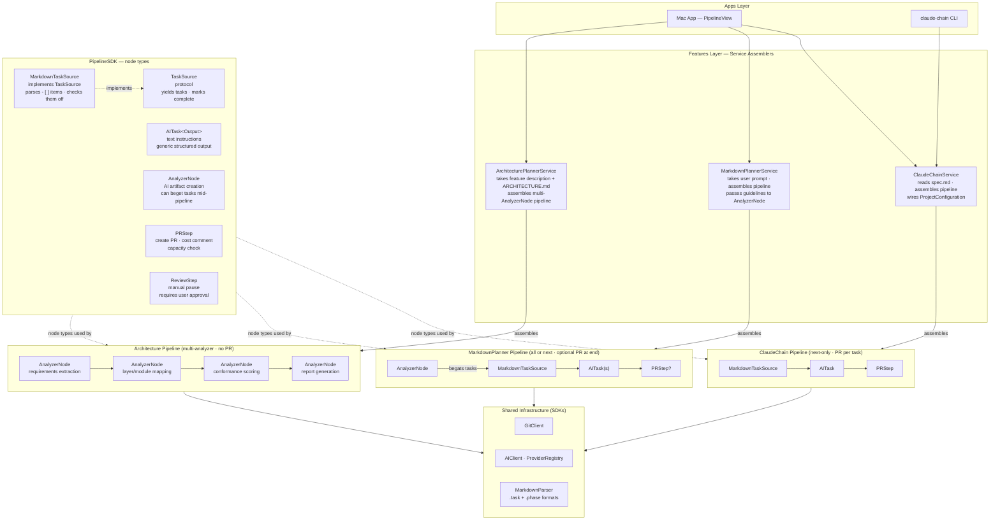

**Read for context:** This is the parent document. Read all sub-plans before working on any phase: [c-pipeline-framework.md](2026-04-02-c-pipeline-framework.md), [d-architecture-tab-migration.md](2026-04-02-d-architecture-tab-migration.md), [e-plans-tab-migration.md](2026-04-02-e-plans-tab-migration.md), [f-claude-chain-migration.md](2026-04-02-f-claude-chain-migration.md)

---

## End-State Architecture

### Component Responsibilities

**Apps Layer**
- **Mac App (`PipelineView`)** — a single unified view driven by pipeline configuration. Shared across all pipeline consumers: task list with completion state, execution output stream, current-node progress. Consumer-specific panels appear when the pipeline includes relevant node types: PR enrichment panel when a `PRStep` is present; architecture diagram panel when an `AnalyzerNode` produces one; plan lifecycle controls when `MarkdownPlannerService` assembled the pipeline.
- **`claude-chain` CLI** — entry point for GitHub Actions and local automation. Delegates to `ClaudeChainService` which assembles and runs the pipeline. No CLI surface for MarkdownPlanner today.

**Features Layer — Service Assemblers**

These are not execution engines — they are assemblers. Each service reads its inputs, constructs the appropriate pipeline from node types, and hands it to the `Pipeline` to run. All actual execution is delegated to the pipeline. The three Mac app tabs (Architecture, Plans, Claude Chain) each have a service assembler; they share all SDK infrastructure and differ only in what pipeline they assemble.

- **`ClaudeChainService`** — reads `spec.md` from disk, creates a `MarkdownTaskSource`, wires in `ProjectConfiguration` (baseBranch, assignees, reviewers, labels, maxOpenPRs), appends a `PRStep`. Configures the pipeline for next-only execution. Does not execute tasks itself.
- **`MarkdownPlannerService`** — takes a user prompt and optional guidelines, constructs an `AnalyzerNode` configured for plan generation and architecture diagram output, attaches the resulting `MarkdownTaskSource` after it, optionally appends a `PRStep` at the end. Configures the pipeline for all-phases or next-only.
- **`ArchitecturePlannerService`** — takes a feature description and reads `ARCHITECTURE.md` from the target repo. Assembles a sequential pipeline of `AnalyzerNode` steps: requirements extraction → layer/module mapping → conformance scoring → report generation. No `TaskSource` or `PRStep` — this pipeline is purely analytical. SwiftData-backed job persistence (currently in `ArchitecturePlannerFeature`) stays at the service layer; the pipeline nodes themselves are stateless.

**PipelineSDK — Node Types**

- **`Pipeline`** — the execution engine. Owns a sequence of `PipelineNode` values. Supports: stop, pause, start-at-index, and consistent progress reporting. Configuration controls: execute-next-only vs. all, maxMinutes, provider selection, stagingOnly. Does not know what any node does — it just drives them in order and handles completion/error states.
- **`TaskSource` (protocol)** — yields `AITask` instances and accepts completion notifications. The pipeline has no knowledge of how tasks are stored or what "complete" means to the underlying source. `MarkdownTaskSource` is the only current implementation; others (e.g. a database-backed source) are possible.
- **`AITask<Output>`** — a fundamental pipeline node. Receives text instructions and executes them against the configured AI provider. Generic over `Output`: the result type can be `CodeChanges`, a structured JSON type, or `Void`. Has no knowledge of markdown, PR creation, or any surrounding context — it only knows about its instructions and its expected output shape.
- **`AnalyzerNode`** — an AI-driven node that produces structured artifacts rather than code changes. Takes inputs (user request, guidelines, previous step results) and produces outputs such as a markdown plan, an architecture diagram model, or a conformance report. Can dynamically beget new tasks into the pipeline (e.g. plan generation creates a `MarkdownTaskSource` whose tasks are then appended to the pipeline mid-run).
- **`PRStep`** — creates a draft PR from the preceding work, applies assignees/reviewers/labels, checks capacity (`maxOpenPRs`), posts a cost breakdown comment. Can be placed after every `AITask` (ClaudeChain mode) or once at the end of the pipeline (MarkdownPlanner optional mode).
- **`ReviewStep`** — pauses the pipeline and surfaces a manual approval gate to the user. The pipeline does not continue until the user approves. Useful for high-risk runs or before the `PRStep`.
- **`MarkdownTaskSource`** — implements `TaskSource`. Parses `- [ ]` / `- [x]` checkbox items from a markdown file (using `MarkdownParser`). Yields them as `AITask` instructions. When the pipeline calls `markComplete(_:)`, it checks off the corresponding line in the file. The pipeline and `AITask` nodes are entirely unaware that markdown is involved.

**Shared Infrastructure (SDKs)**
- **`GitClient`** — all git operations. Used by `AITask` (commit), `PRStep` (push, branch), and `ClaudeChainService` (fetch/checkout base branch).
- **`AIClient` / `ProviderRegistry`** — provider-agnostic AI execution. Used by `AITask` and `AnalyzerNode`. Provider (Claude CLI, Codex, Anthropic API) is a pipeline-level configuration.
- **`MarkdownParser`** — parses and rewrites markdown spec files. Supports `.task` (`- [ ]`) and `.phase` (`## - [ ]`) formats. Used exclusively by `MarkdownTaskSource`; nothing else in the pipeline layer touches markdown.

---

## Relevant Skills

| Skill | Description |
|-------|-------------|
| `swift-architecture` | 4-layer architecture (Apps, Features, Services, SDKs) — ensures shared executor lands in the right layer |
| `ai-dev-tools-review` | Reviews Swift files for architecture conformance — use during each phase to validate placement |
| `configuration-architecture` | Guide for adding configuration — relevant when designing executor config (single-task vs. all-tasks, PR mode) |
| `claude-chain` | Manages ClaudeChain PR chains — context for ClaudeChain's existing behavior and expectations |

---

## Background

### Current State: Three Overlapping Features

This plan addresses the architectural overlap between three existing features and charts a path to unify the execution engine underlying them. The features are:

---

#### Feature 1: Claude Chain (`ClaudeChainFeature`)

**What it does:** Reads a markdown spec file where each checkbox item (`- [ ] task description`) is a task. Takes the *next* pending task, creates a fresh AI context window, executes the task, commits, creates a draft PR, posts a cost/progress comment, and optionally runs a review pass. Each task becomes exactly one PR.

**Key files:**
- `RunChainTaskUseCase.swift` — main orchestrator (prepare → pre-script → AI → post-script → finalize → review → summary → PR comment)
- `FinalizeStagedTaskUseCase.swift` — creates a PR for a locally-staged (pre-run) task
- `GetChainDetailUseCase.swift` — fetches PR enrichment (CI status, reviewers, action items)
- `ExecuteChainUseCase.swift` — multi-task orchestration loop
- `ChainModels.swift` — `ChainProject`, `ChainTask` (index, description, isCompleted)
- `ChainEnrichmentModels.swift` — `EnrichedChainTask`, `EnrichedPR`, `ChainActionItem` (action kinds: ciFailure, draftNeedsReview, mergeConflict, stalePR)
- `PRService.swift` — branch naming, PR creation
- `SpecContent.swift` — parsed spec.md representation
- Mac app: `ClaudeChainView.swift`, `ClaudeChainModel.swift`
- CLI: `RunTaskCommand.swift`, `FinalizeStagedCommand.swift`, `StatusCommand.swift`

**Markdown format:** `MarkdownPipelineSource` with `.task` format — parses `- [x]` / `- [ ]` lines

**PR behavior:**
- Creates PR after every task (mandatory, unless `stagingOnly: true`)
- Checks capacity (`maxOpenPRs`) before running
- Adds assignees, reviewers, labels from `ProjectConfiguration`
- Posts a cost breakdown comment with task progress (X/Y)
- Optional `review.md` pass with structured JSON conformance output

**Unique capabilities not in other features:**
- PR creation per task
- Cost/token tracking and PR comment reporting
- Capacity checks (`maxOpenPRs`)
- `review.md` review pass with conformance scoring
- Task hashing (`TaskService.generateTaskHash()`)
- Project configuration: assignees, reviewers, labels, baseBranch
- CLI access (`claude-chain` command)
- PR enrichment: CI status, draft status, merge conflicts, stale detection

---

#### Feature 2: Markdown Planner (`MarkdownPlannerFeature`)

**What it does:** Generates a phased markdown plan from natural language input (AI-assisted), then executes phases one by one or all at once, each in its own AI context. Has no PR creation. Can detect and display an architecture diagram JSON artifact. Moves completed plans to a `completed/` directory.

**Key files:**
- `GeneratePlanUseCase.swift` — AI-driven: repo matching → plan generation → writes dated markdown file
- `ExecutePlanUseCase.swift` — executes phases (all or next-only), marks complete, enforces time limits
- `LoadPlansUseCase.swift`, `GetPlanDetailsUseCase.swift`, `CompletePlanUseCase.swift`
- `TogglePhaseUseCase.swift`, `IntegrateTaskIntoPlanUseCase.swift`
- `PlanPhase.swift` — `PlanPhase` (index, description, isCompleted)
- `ArchitectureDiagram.swift` — `ArchitectureLayer`, `ArchitectureModule`, `ArchitectureChange`
- Mac app: `MarkdownPlannerDetailView.swift`, `PlansContainer.swift`, `MarkdownPlannerModel.swift`

**Markdown format:** `MarkdownPipelineSource` with `.phase` format — parses `## - [x]` / `## - [ ]` phase headers

**PR behavior:** None. Phases can include `gh pr create` as an explicit AI action, but the framework doesn't orchestrate it.

**Unique capabilities not in other features:**
- AI-assisted plan *generation* (repo matching + plan synthesis from CLAUDE.md context)
- "Run all" execution mode (ClaudeChain only ever runs one task)
- Date-prefixed filename generation (`YYYY-MM-DD-alpha-description.md`)
- Plan lifecycle management (proposed → completed directory)
- Architecture diagram detection and native visualization (`ArchitectureDiagramView`)
- `maxMinutes` time limit enforcement
- `stopAfterArchitectureDiagram` execution flag
- Phase-level log files (`plan-logs/planname/phase-N.stdout`)
- `IntegrateTaskIntoPlanUseCase` — appending tasks mid-execution
- `WatchPlanUseCase` — file watching

---

#### Feature 3: Architecture Planner (`ArchitecturePlannerFeature`)

**What it does:** A structured pre-implementation planner. Takes a natural language feature description, extracts discrete requirements, maps them to architectural layers using project guidelines, evaluates conformance, scores each component, and generates a report. Uses SwiftData for persistent job storage. Has no PR creation, no markdown-based execution.

**Key files:**
- `CreatePlanningJobUseCase.swift`, `FormRequirementsUseCase.swift`
- `CompileArchitectureInfoUseCase.swift` — reads `ARCHITECTURE.md` from target repo
- `PlanAcrossLayersUseCase.swift` — maps requirements → `ImplementationComponent` objects
- `ExecuteImplementationUseCase.swift` — evaluates components against guidelines, records decisions + flags
- `ScoreConformanceUseCase.swift`, `GenerateReportUseCase.swift`
- `ArchitecturePlannerModels.swift` (SwiftData): `PlanningJob`, `Requirement`, `Guideline`, `GuidelineCategory`, `ImplementationComponent`, `GuidelineMapping`, `ProcessStep`, `UnclearFlag`, `PhaseDecision`, `FollowupItem`
- Mac app: `ArchitecturePlannerView.swift`, `ArchitecturePlannerDetailView.swift`, `GuidelineBrowserView.swift`

**PR behavior:** None.

**Unique capabilities:**
- SwiftData-backed persistent jobs (survives app restarts)
- Structured guideline library with categories, matchers, good/bad examples
- Requirements extraction from natural language
- Layer/module mapping per requirement
- Conformance scoring (0-100) per component-guideline pairing
- Unclear flags (ambiguity detection in guideline application)
- Follow-up item tracking
- `ARCHITECTURE.md` integration from target repo
- Not markdown-based — uses JSON/structured AI output throughout

---

### Shared Infrastructure Today

Both ClaudeChain and MarkdownPlanner share:
- `MarkdownPipelineSource` (different format enums, same underlying parser/rewriter)
- `GitClient`
- `AIClient` protocol + `AIClientOptions`
- `RepositoryConfiguration` SDK
- `ChatModel` for streaming output
- `ProviderRegistry`

ArchitecturePlanner uses `RepositoryConfiguration` and the AI provider system but has its own entirely separate data layer (SwiftData).

---

### The Unification Vision

At the top level, this is a **pipeline**. A pipeline is an ordered sequence of composable nodes. Different consumers (ClaudeChain, MarkdownPlanner, a future PR Reviewer) assemble different pipelines from the same set of node types. The pipeline provides consistent behavior — stop, pause, start-at-index, progress visibility, provider selection — regardless of what nodes it contains.

**Node types (the mix-and-match vocabulary):**

- **`TaskSource`** — a protocol. Yields tasks and accepts completion notifications. The pipeline has no knowledge of what backs the source. `MarkdownTaskSource` is the concrete impl — it reads `- [ ]` items and checks them off when told to, but nothing in the pipeline layer knows that.
- **`AITask<Output>`** — the fundamental unit of AI work. Takes text instructions, produces a generic typed output. No markdown knowledge. No PR knowledge. Just: "here are instructions, here is the expected output shape."
- **`AnalyzerNode`** — AI-driven artifact creation. Produces structured outputs (markdown plan, architecture diagram, conformance report). Can beget new tasks into the running pipeline (e.g. plan generation creates a `MarkdownTaskSource` mid-run whose tasks are then executed). Can be placed before, after, or between AI tasks.
- **`PRStep`** — creates a PR from preceding work. Position in the pipeline determines whether it runs per-task or once at the end.
- **`ReviewStep`** — manual pause. The pipeline waits for user approval before continuing.

**Markdown lives outside the pipeline.** Markdown is parsed at the assembler level (`ClaudeChainService`, `MarkdownPlannerService`) before the pipeline starts. A `MarkdownTaskSource` wraps the parsed result and presents it to the pipeline as an opaque task source. The pipeline and all nodes inside it are unaware of markdown.

**Concrete pipeline configurations:**

*ClaudeChain:* `MarkdownTaskSource → AITask → PRStep` (configured: next-only, PR per task)

*MarkdownPlanner:* `AnalyzerNode → MarkdownTaskSource → AITask(s) → PRStep?` (configured: all or next, optional PR at end; `AnalyzerNode` creates the `MarkdownTaskSource` dynamically)

**The goal is to unify all three Mac app tabs — Architecture, Plans, and Claude Chain — onto the same pipeline infrastructure.** The tabs remain as distinct UI surfaces with different service assemblers and use cases. Internally, every tab runs a `Pipeline` composed of the same node types (`AnalyzerNode`, `AITask`, `TaskSource`, `PRStep`, `ReviewStep`). No tab has its own execution engine.

Near-term priority order:
1. Design and implement the `Pipeline` framework and node type protocols
2. Implement `MarkdownTaskSource` + `MarkdownParser` as first-class SDK types
3. Migrate `ClaudeChainService` to assemble and run a pipeline (replacing `RunChainTaskUseCase`'s monolithic loop)
4. Migrate `MarkdownPlannerService` to assemble and run a pipeline (replacing `ExecutePlanUseCase`'s loop)
5. Migrate `ArchitecturePlannerService` to assemble and run a multi-`AnalyzerNode` pipeline (replacing the current ad-hoc use-case chain in `ArchitecturePlannerFeature`)
6. Implement `AnalyzerNode` fully (covers plan generation, architecture analysis, conformance scoring, post-execution analysis)
7. Unified Mac App `PipelineView` shared across all three tabs
8. `PRStep` as a first-class pipeline node (extracted from current `RunChainTaskUseCase`)

---

## Sub-Plans

This parent document captures the end-state architecture and overall phase sequence. Each implementation milestone has its own detailed plan:

| Plan | Scope | Prerequisites |
|------|-------|---------------|
| [2026-04-02-c-pipeline-framework.md](2026-04-02-c-pipeline-framework.md) | Design and implement `PipelineSDK` — all node types, protocols, and unit tests. No changes to existing features. | None |
| [2026-04-02-d-architecture-tab-migration.md](2026-04-02-d-architecture-tab-migration.md) | Migrate Architecture tab to `ArchitecturePlannerService` + `AnalyzerNode` pipeline. | Plan C complete |
| [2026-04-02-e-plans-tab-migration.md](2026-04-02-e-plans-tab-migration.md) | Migrate Plans tab to `MarkdownPlannerService` + `MarkdownTaskSource` pipeline. | Plan C complete |
| [2026-04-02-f-claude-chain-migration.md](2026-04-02-f-claude-chain-migration.md) | Migrate Claude Chain tab to `ClaudeChainService` + `PRStep` pipeline. Unified `PipelineView` polish. | Plan C complete |

---

## Phases

## - [ ] Phase 1: Inventory Execution Path Differences

**Skills to read:** `swift-architecture`, `ai-dev-tools-review`

Perform a line-by-line comparison of `RunChainTaskUseCase.swift` and `ExecutePlanUseCase.swift` to produce a concrete diff of divergent behavior. The goal is to understand exactly what behavior each has that must be preserved or mapped to a pipeline node, so Phase 2's interface design is grounded in reality.

Specific items to document:
- How each discovers the next pending step (task regex vs. phase regex, index tracking)
- How each builds the AI prompt (what context is embedded, what format)
- What happens before AI execution (pre-scripts, capacity checks, hash generation)
- What happens after AI execution (commit, PR creation, marking complete, log files, time tracking)
- Error handling and partial failure behavior
- How `stagingOnly` / dry-run modes differ
- What configuration each reads (`ProjectConfiguration` vs. `ExecutePlanOptions`)
- What output each emits (summaries, costs, logs, artifacts)

Deliverable: a table mapping each behavior to its future pipeline node (AITask, PRStep, MarkdownTaskSource, etc.), flagging anything that doesn't have a clear home yet.

## - [ ] Phase 2: Design the Pipeline Framework

**Skills to read:** `swift-architecture`, `configuration-architecture`

Design (but do not implement) the pipeline framework. This is the architectural decision phase — all interfaces must be agreed upon before any code is written.

Decisions to make and document inline:

- **Layer placement:** `PipelineSDK` target — confirm with `swift-architecture`
- **`PipelineNode` protocol:** base protocol for all node types. What does a node expose? (run, progress reporting, cancellation)
- **`TaskSource` protocol:** `nextTask() -> AITask?`, `markComplete(_ task: AITask)`. What does `AITask` carry? (instructions: String, id, structured output type)
- **`AITask<Output>` generics:** how Swift generics apply here. Does the pipeline need to be typed over Output, or does each node handle its own typing internally?
- **`AnalyzerNode`:** inputs (prompt, guidelines, prior results), outputs (typed artifact + optional new `TaskSource`). How does a mid-pipeline `TaskSource` get spliced into the running pipeline?
- **`PRStep`:** inputs (branch, baseBranch, config), outputs (PR URL, PR number). How does it receive the result of preceding `AITask` nodes?
- **`ReviewStep`:** how the pipeline pauses and resumes. What does the Mac app need to surface?
- **`Pipeline` configuration:** `executionMode` (.nextOnly | .all), `maxMinutes`, `stagingOnly`, `provider`. How is provider injected?
- **`MarkdownTaskSource`:** confirm it implements `TaskSource` and that `MarkdownParser` is the only markdown-aware type in the SDK layer
- **Pre/post scripts:** do these become a wrapping node type, or are they ClaudeChain-specific and stay in `ClaudeChainService`?

Deliverable: a design document (or inline spec in this plan) capturing all interfaces before Phase 3 begins. This phase ends with Bill reviewing and approving the design.

## - [ ] Phase 3: Implement the Pipeline Framework

**Skills to read:** `swift-architecture`

Implement the `PipelineSDK` designed in Phase 2, without yet migrating ClaudeChain or MarkdownPlanner. Both continue to work exactly as before.

Tasks:
- Create or extend `PipelineSDK` target
- Implement `PipelineNode` protocol
- Implement `TaskSource` protocol and `AITask<Output>`
- Implement `MarkdownTaskSource` — wraps `MarkdownParser`, implements `TaskSource`
- Implement `Pipeline` — the execution loop (stop, pause, start-at-index, progress reporting)
- Implement `AITask` node execution (delegates to `AIClient`)
- Implement `PRStep` node (PR creation, cost comment, capacity check)
- Implement `ReviewStep` node (pause + resume)
- Write unit tests for: next-task selection, all-tasks mode, task completion marking, pipeline pause/resume, `MarkdownTaskSource` checkbox round-trip

This phase produces a new SDK target that compiles and is tested but is not yet wired up to any feature.

## - [ ] Phase 4: Implement ClaudeChainService Using the Pipeline

**Skills to read:** `swift-architecture`, `ai-dev-tools-review`, `claude-chain`

Replace `RunChainTaskUseCase`'s monolithic loop with a `ClaudeChainService` that assembles and runs a pipeline. ClaudeChain is the first migration because it has no `AnalyzerNode` — the pipeline is straightforward: `MarkdownTaskSource → AITask → PRStep`.

Tasks:
- Create `ClaudeChainService` in `ClaudeChainFeature`
- Service reads `spec.md`, creates `MarkdownTaskSource`, wires `ProjectConfiguration` (baseBranch, assignees, reviewers, labels, maxOpenPRs) into `PRStep`
- Assembles pipeline: `[MarkdownTaskSource, AITask, PRStep]`
- Configures pipeline for next-only execution
- `RunChainTaskUseCase` becomes a thin wrapper around `ClaudeChainService` (preserves existing API for CLI and GitHub Actions)
- Preserve all ClaudeChain-unique behaviors:
  - Pre-script / post-script invocation (wrapping nodes or service-level logic)
  - Task hash generation
  - Cost extraction from AI stream metrics
  - `review.md` review pass with structured JSON output
  - Summary AI call and PR comment formatting
  - `FinalizeStagedTaskUseCase` — audit whether it uses the pipeline or stays separate
- Run ClaudeChain against `claude-chain-demo` end-to-end
- Verify PR creation, cost comment, capacity check, review pass all work

This phase must not regress any existing ClaudeChain behavior.

## - [ ] Phase 5: Implement MarkdownPlannerService Using the Pipeline

**Skills to read:** `swift-architecture`, `ai-dev-tools-review`

Replace `ExecutePlanUseCase`'s loop with a `MarkdownPlannerService` that assembles a pipeline including an `AnalyzerNode`. This is the first use of `AnalyzerNode`.

Tasks:
- Implement `AnalyzerNode` configured for plan generation: takes user prompt + optional guidelines, produces a markdown plan and optional architecture diagram model, begats a `MarkdownTaskSource` from the generated markdown
- Create `MarkdownPlannerService` in `MarkdownPlannerFeature`
- Assembles pipeline: `[AnalyzerNode, MarkdownTaskSource, AITask(s)]` with optional `PRStep` at end
- Configures pipeline for all-phases or next-only depending on user selection
- Preserve all MarkdownPlanner-unique behaviors:
  - `maxMinutes` enforcement (pipeline-level config)
  - `stopAfterArchitectureDiagram` (AnalyzerNode callback or pipeline flag)
  - Phase log files
  - Plan lifecycle: proposed → completed directory move
  - `IntegrateTaskIntoPlanUseCase` compatibility
- Run MarkdownPlanner against a sample plan end-to-end
- Verify architecture diagram detection and plan lifecycle work

Risk: `stopAfterArchitectureDiagram` and dynamic task injection from `AnalyzerNode` are the two novel pipeline behaviors. Design the splice mechanism carefully in Phase 2.

## - [ ] Phase 6: Migrate ArchitecturePlannerFeature to Pipeline

**Skills to read:** `swift-architecture`, `ai-dev-tools-review`

Replace the current ad-hoc use-case chain in `ArchitecturePlannerFeature` with an `ArchitecturePlannerService` that assembles a pipeline of `AnalyzerNode` steps. This completes the three-tab unification at the service layer.

The current `ArchitecturePlannerFeature` runs these steps in sequence using individual use cases:
1. `FormRequirementsUseCase` — extracts discrete requirements from a feature description
2. `CompileArchitectureInfoUseCase` — reads `ARCHITECTURE.md` from the target repo
3. `PlanAcrossLayersUseCase` — maps requirements → `ImplementationComponent` objects per layer
4. `ExecuteImplementationUseCase` — evaluates components against guidelines, records decisions and flags
5. `ScoreConformanceUseCase` — scores each component-guideline pairing (0–100)
6. `GenerateReportUseCase` — produces the final conformance report

Each of these becomes a typed `AnalyzerNode<Input, Output>` step. The pipeline connects them: each node's output is the next node's input.

Tasks:
- Audit each existing use case to determine its input/output types for `AnalyzerNode` generic parameters
- Create `ArchitecturePlannerService` in `ArchitecturePlannerFeature`
- Assemble pipeline: `[RequirementsNode, ArchInfoNode, LayerMappingNode, ConformanceNode, ScoringNode, ReportNode]`
- SwiftData job persistence stays in `ArchitecturePlannerService` — pipeline nodes are stateless; the service saves results after each node completes
- Replace the existing use-case orchestration in `ArchitecturePlannerModel` with `ArchitecturePlannerService`
- Verify all existing Architecture tab behaviors work: requirements list, layer mapping view, guideline browser, conformance scores, follow-up items, report generation
- The `ArchitecturePlannerView` continues to exist as its own tab — it is not merged into `PipelineView` yet (that is Phase 7)

## - [ ] Phase 7: Unify Mac App UI (PipelineView)

**Skills to read:** `swift-architecture`

All three tabs now run pipelines. The Mac app UI should be a single `PipelineView` driven by what node types the pipeline contains. The three tabs remain — each tab's service assembler configures the pipeline, and `PipelineView` renders it.

Tasks:
- Design `PipelineView`: shared elements (node list with completion state, execution output stream, current-node progress, stop/pause/start-at controls)
- Conditional panels driven by pipeline contents:
  - `PRStep` present → PR enrichment panel (CI status, draft, merge conflicts, action items)
  - `AnalyzerNode` produced architecture diagram → diagram visualization panel
  - MarkdownPlanner pipeline → plan lifecycle controls (proposed/completed directory)
  - Architecture pipeline → requirements list, layer mapping, guideline browser, conformance scores
- Replace `ClaudeChainView`, `MarkdownPlannerDetailView`, and `ArchitecturePlannerDetailView` with `PipelineView` + consumer-specific extension panels
- Each tab retains its own sidebar (project list, plan list, job list) — `PipelineView` is the detail panel, not the whole tab
- Verify all three tab configurations render correctly

Design before implementing. The three views are different enough that a shared base view with per-tab extension panels is more realistic than a single fully merged view.

## - [ ] Phase 8: AnalyzerNode as Post-Execution Analysis

**Skills to read:** `swift-architecture`, `ai-dev-tools-review`

`AnalyzerNode` already exists for plan generation (Phase 5) and architecture analysis (Phase 6). Use it for optional post-execution conformance analysis appended to any pipeline.

Tasks:
- Configure `AnalyzerNode` for conformance analysis mode: takes execution artifacts (git diff, spec content, PR URLs, phase logs) + guideline library from `ArchitecturePlannerFeature`, produces a conformance report
- Design the data handoff: what does the pipeline pass to a post-execution `AnalyzerNode`?
- Append an optional `AnalyzerNode` to any ClaudeChain or MarkdownPlanner pipeline for post-run analysis
- Visualize conformance results in `PipelineView`
- `ArchitecturePlannerFeature`'s guideline library and scoring infrastructure are reused — `AnalyzerNode` calls into them

## - [ ] Phase 9: Validation

**Skills to read:** `ai-dev-tools-review`

End-to-end validation across all migrated surfaces.

Automated:
- Run all unit tests across `ClaudeChainFeature`, `MarkdownPlannerFeature`, `ArchitecturePlannerFeature`, and `PipelineSDK`
- Run any existing integration tests

Manual / CLI:
- **Claude Chain tab:** Run `claude-chain run-task` against `claude-chain-demo` — verify task selection, AI execution, PR creation, cost comment, review pass, capacity check
- **Claude Chain tab:** Run `claude-chain finalize-staged` — verify PR creation still works
- **Claude Chain tab:** Run `claude-chain status` — verify enriched PR output unchanged
- **Plans tab:** Run plan generation + execution (all-phases mode) — verify phase completion, log files, architecture diagram detection
- **Plans tab:** Run with optional end-of-run PR — verify PR is created after last phase
- **Architecture tab:** Run a job through all steps — verify requirements list, layer mapping, guideline browser, conformance scores, follow-up items, report generation all work
- **All tabs:** Verify `PipelineView` renders correctly for each pipeline configuration (PR enrichment panel, diagram panel, plan lifecycle, conformance scores)

Success criteria:
- No regression in any existing tab behavior
- All three tabs share `PipelineView` as the detail panel
- All three service assemblers produce correct pipelines
- `PipelineSDK` unit tests pass
- All feature-level unit tests pass
