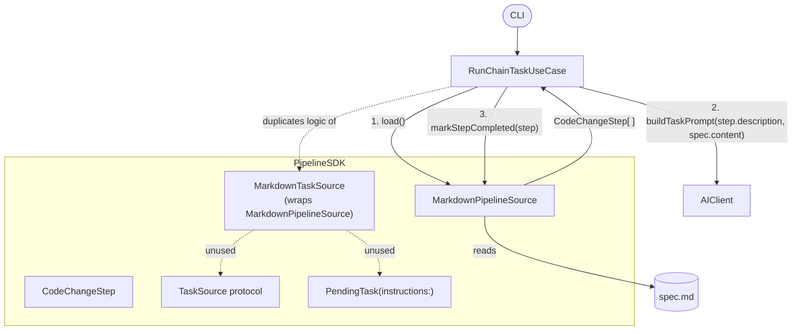
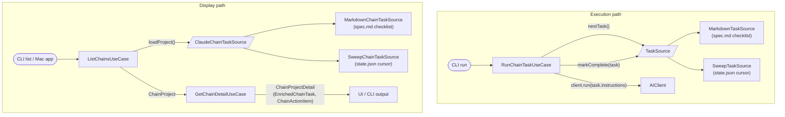

## Relevant Skills

| Skill | Description |
|-------|-------------|
| `configuration-architecture` | Guide for wiring new config through the app layers |
| `logging` | Add logging to execution paths |
| `swift-app-architecture:swift-architecture` | 4-layer architecture — new feature spans SDK, Service, Feature, and Apps layers |

---

## Background

Sweep is **ClaudeChain operating in a different configuration**, not a standalone feature. ClaudeChain's pipeline is made configurable via the `TaskSource` protocol; Sweep plugs in its own implementation. Unlike the default ClaudeChain mode (finite user-authored checklist in `spec.md`), sweep tasks are **ongoing**: the system sweeps through files in a codebase on a rolling schedule, running the AI on each one in turn.

---

## Architecture Diagrams

### Before: RunChainTaskUseCase bypasses TaskSource

`RunChainTaskUseCase` duplicates inline what `MarkdownTaskSource` already does — it uses `MarkdownPipelineSource` and `CodeChangeStep` directly rather than calling `MarkdownTaskSource`. `TaskSource` and `PendingTask` go unused.



### After: Two protocols, one shared downstream

Two protocols cover the two concerns. Everything downstream of extraction — enrichment, display models, action items — is shared unchanged.

**Execution path** — `TaskSource` (existing, in `PipelineSDK`): returns one `PendingTask` with instructions built in. Used by `RunChainTaskUseCase`.

**Display path** — `ClaudeChainTaskSource` (new, in `ClaudeChainService`): returns a full `ChainProject` with all tasks. Used by `ListChainsUseCase` and `GetChainDetailUseCase`.



`ChainProject` gains a `branchPrefix` field (`"claude-chain-<name>-"`) so `GetChainDetailUseCase` can match PRs to tasks without hardcoding the ClaudeChain prefix.

---

## Core Architectural Insight

`TaskSource` and `PendingTask` already exist in `PipelineSDK`:

```swift
public protocol TaskSource: Sendable {
    func nextTask() async throws -> PendingTask?
    func markComplete(_ task: PendingTask) async throws
}

public struct PendingTask: Sendable, Identifiable {
    public let id: String
    public let instructions: String   // full AI prompt — built by the task source
    public let skills: [String]
}
```

`MarkdownTaskSource` already implements `TaskSource` for ClaudeChain. `RunChainTaskUseCase` currently duplicates its logic inline, leaving `TaskSource` and `PendingTask` unused. Phase 0 fixes that.

A second protocol handles the display side. `ClaudeChainTaskSource` lives in `ClaudeChainService` and returns a `ChainProject` — the model already used by `ListChainsUseCase`, `GetChainDetailUseCase`, and the Mac app:

```swift
public protocol ClaudeChainTaskSource: Sendable {
    func loadProject() async throws -> ChainProject
}
```

Once either implementation produces a `ChainProject`, the entire downstream pipeline — GitHub PR enrichment, `EnrichedChainTask`, `ChainActionItem`, `ChainProjectDetail`, display views — is shared with no duplication.

| Abstraction | Purpose | ClaudeChain impl | Sweep impl |
|---|---|---|---|
| `TaskSource` | Execution — next task to run, mark done | `MarkdownTaskSource` — spec.md checklist | `SweepTaskSource` — cursor in state.json |
| `ClaudeChainTaskSource` | Display — all tasks with status | `MarkdownChainTaskSource` — spec.md → `ChainProject` | `SweepChainTaskSource` — state.json → `ChainProject` |
| `ChainProject.branchPrefix` | PR matching in enrichment | `"claude-chain-<name>-"` | `"claude-chain-<name>-"` |

---

## Cursor Approach

### Core Concept

The system maintains a single **cursor**: the path of the last file processed. A **filePattern** in `config.yaml` defines the set of paths subject to sweeping. On each **batch**:

1. Check for open sweep PRs — if any exist, throw an error (always one batch at a time)
2. Load cursor from `state.json`
3. Expand `filePattern` from disk and sort results alphabetically; cursor wraps to beginning when it reaches the end
4. Find the file after the cursor in that list (or start from the beginning if cursor is unset)
5. Run tasks forward from that position, subject to `scanLimit` and `changeLimit`
6. Open one PR containing all changed files from the batch
7. Write the cursor commit

### Terminology

- **Batch**: One invocation of `sweep run`. Processes up to `scanLimit` tasks serially.
- **Task**: One AI invocation on one file, in its own fresh context. Counts toward `scanLimit` regardless of outcome.
- **Modifying task**: A task that produced any diff — in any file across the repo, not necessarily the target file. One changing task = one increment toward `changeLimit`, regardless of how many files were touched.

A task can complete without producing changes (AI determined no action needed). The cursor still advances.

### AI Context Per Task

Each task uses a **fresh AI context** (`AITask`), run serially within the batch. If `scanLimit` is 10, a batch may create up to 10 separate AI contexts. A fresh context per task ensures prior work — diffs, discussion, unrelated changes — does not bleed into subsequent tasks and degrade AI performance. This matches how ClaudeChain processes tasks: one isolated context per task.

### `config.yaml` Schema

```yaml
scanLimit: 10      # max tasks to run in one batch (default: 1)
changeLimit: 3     # max tasks per batch that produce any diff (default: 1, never > scanLimit)
filePattern: "Sources/**/*.swift"
scope:
  from: "Sources/Features/ExerciseFeature/"   # required: files whose path >= this prefix
  to: "Sources/Features/FixtureFeature/"      # optional: files whose path < this prefix
```

- `scanLimit`: how many tasks the AI will run in one batch
- `changeLimit`: how many tasks per batch may produce any diff (across all files) before the batch stops; a single task on one file may change that file plus supporting files elsewhere — this counts as one toward `changeLimit`
- `changeLimit` defaults to 1; `scanLimit` defaults to 1; `changeLimit` must always be ≤ `scanLimit`
- `filePattern`: glob pattern; results sorted alphabetically to form the full candidate list
- `scope`: optional; restricts the cursor to a sub-range of the sorted `filePattern` results
  - `from` only: files whose path has this prefix (single directory/area)
  - `from` + `to`: files where `path >= from && path < to` (lexicographic range)
- Open PR limit is always 1 — if any sweep PR is open, the batch throws an error

### `state.json` Schema

```json
{
  "cursor": "Sources/Services/FooService.swift",
  "lastRunDate": "2026-04-04T12:00:00Z"
}
```

Written atomically once at the end of each batch — not after each individual task. `lastRunDate` is informational; ordering and skip detection are driven by the cursor and cursor commit respectively.

### `spec.md` Format

Free-form AI instructions only. No checklist. `SweepTaskSource` appends the file path at execution time before returning the `PendingTask`.

```markdown
Review this file for service layer convention compliance. Remove dead code,
fix naming, and ensure protocol conformance is correct. If the file already
conforms well, make no changes and explain why in the PR description.
```

### File Layout

```
claude-chain-sweep/<task-name>/
  config.yaml    # scanLimit, changeLimit, filePattern, scope (optional)
  spec.md        # AI instructions only
  state.json     # cursor only
```

### Branch Naming

`claude-chain-<task-name>-<8-char-sha256-of-path>` — same prefix convention as ClaudeChain. `GetChainDetailUseCase` uses `ChainProject.branchPrefix` to match PRs to tasks.

### Cursor Commit

At the end of each batch, the cursor update to `state.json` is committed to the branch with a structured message that records every file visited in the batch — including files the AI ran on but did not change:

```
[claude-sweep] task=service-compliance cursor=Sources/Services/FooService.swift
processed: Sources/Services/BarService.swift Sources/Services/BazService.swift Sources/Services/FooService.swift
```

This commit becomes the reference point for skip detection on future batches. The `processed:` list of paths is all that needs to be stored — no file hashes. Git computes the hash of any file at any commit on demand via `git rev-parse <commit>:<path>`, so storing hashes explicitly would just duplicate what git already knows.

### Skip Detection

Before running a task on a file, check if it can be skipped:

1. Search `git log --grep="claude-sweep.*task=<name>"` for the last cursor commit
2. If the file appears in the `processed:` list of that commit:
   - Compute `git rev-parse <cursor-commit>:<path>` — the file's hash at time of last processing
   - Compare to `git rev-parse HEAD:<path>` — the file's current hash
   - Match → skip; cursor still advances past the file without consuming a task slot
   - Mismatch → run task
3. If not found in any cursor commit → run task

Skipped files do not count toward `scanLimit` or `changeLimit`.

### Execution Algorithm

```
if openSweepPRCount > 0: throw error

allPaths    = expandGlobFromDisk(config.filePattern).sorted()
scopedPaths = applyScopeFilter(allPaths, config.scope)   # no-op if scope is nil
startIndex  = indexAfterCursor(scopedPaths, state.cursor) or 0  # wraps to 0 at end

tasks = 0
modifyingTasks = 0
processedPaths = []   # all paths visited this batch (for cursor commit)

for path in scopedPaths[startIndex...]:
    if tasks >= scanLimit: break
    if modifyingTasks >= changeLimit: break

    if canSkip(path, taskName):   # git log check; see Skip Detection
        processedPaths.append(path)
        continue

    PipelineRunner.run(nodes: [AITask])   # fresh AI context per file
    tasks += 1
    processedPaths.append(path)

    if any diff resulted (in any file):
        commit changes to branch
        modifyingTasks += 1

if modifyingTasks > 0:
    PipelineRunner.run(nodes: [PRStep, ChainPRCommentStep])   # one PR for all batch commits

commit state.json with cursor = processedPaths.last, lastRunDate = now(), and processed list   # cursor commit
```

---

## Implementation Phases

## - [x] Phase 1: Unified `ClaudeChainSource` Protocol + ClaudeChain Refactor

**Skills used**: `swift-app-architecture:swift-architecture`
**Principles applied**: Added `PipelineSDK` as a dependency of `ClaudeChainService` to allow `ClaudeChainSource: TaskSource`. `MarkdownClaudeChainSource` is an actor (mutable `taskReturned` state for single-task-per-invocation behavior). `ChainProject.branchPrefix` defaults to `"claude-chain-{name}-"` to avoid breaking existing callers. `ListChainsUseCase.run()` became `async throws` since `loadProject()` is async; all callers updated. `loadDetail()` returns unenriched data in Phase 1; `GetChainDetailUseCase` continues to handle enrichment.

Replace the two-protocol split (`ClaudeChainTaskSource` for display, `TaskSource` for execution) with a single unified protocol. Must leave existing ClaudeChain behavior unchanged.

**`ClaudeChainSource`** — extends `TaskSource` so any implementation is also usable by `PipelineRunner`'s `drainTaskSource` loop:
```swift
public protocol ClaudeChainSource: TaskSource {
    var kindBadge: String? { get }   // display label; nil for standard chains
    func loadProject() async throws -> ChainProject
    func loadDetail() async throws -> ChainProjectDetail
    // nextTask() and markComplete() inherited from TaskSource
}
```
GitHub service injected at construction time — used by `loadDetail()`, ignored by `nextTask()`/`markComplete()`.

**`ChainProject` changes:**
```swift
public struct ChainProject {
    public let kindBadge: String?      // display label from source, e.g. "sweep"; nil for standard chains
    public let branchPrefix: String    // replaces hardcoded "claude-chain-" string
    // ... existing fields unchanged
}
```
`kindBadge` is set by each `ClaudeChainSource` implementation via the protocol property `var kindBadge: String? { get }`. `ChainProject` carries it as opaque data for display — no enum, no switching.

**`ChainDiscoveryService`** — new protocol so `ListChainsUseCase` doesn't hardcode directory paths:
```swift
public protocol ChainDiscoveryService: Sendable {
    func discoverSources(repoPath: URL) async throws -> [any ClaudeChainSource]
}
```
- `LocalChainDiscoveryService`: scans `claude-chain/` (regular) and `claude-chain-sweep/` (sweep); instantiates `MarkdownClaudeChainSource` or `SweepClaudeChainSource` per entry
- `GitHubChainDiscoveryService`: extends `ListChainsFromGitHubUseCase` filter to include `"claude-chain-sweep/"` paths

**`MarkdownClaudeChainSource`** — rename/replace `MarkdownChainTaskSource`; implements `ClaudeChainSource` for markdown chains. `nextTask()` returns one task then nil (existing single-task behavior).

**`ListChainsUseCase`** — accepts injected `ChainDiscoveryService`; calls `loadProject()` on each source. Removes hardcoded `"claude-chain"` directory.

**`GetChainDetailUseCase`** — uses `project.branchPrefix` instead of hardcoded `"claude-chain-"`. Adds generic rule: suppress pending tasks when `openPRs.count > 0`.

**`RunSpecChainTaskUseCase`** (renamed from `RunChainTaskUseCase`) — constructs `MarkdownClaudeChainSource` internally; commands pass only plain data (`taskIndex`, `projectName`, `repoPath`). No `source` parameter exposed. Each chain type has its own use case so the source abstraction stays out of the command layer.

**`ExecuteSpecChainUseCase`** (renamed from `ExecuteChainUseCase`) — looping wrapper for `RunSpecChainTaskUseCase`; delegates to `RunSpecChainTaskUseCase` without constructing a source itself.

**`Project.parseSpecPathToProject()`** — add parsing for `claude-chain-sweep/{name}/spec.md` paths.

**`Constants.swift`** — add `sweepChainDirectory = "claude-chain-sweep"`.

Files:
- `Sources/Services/ClaudeChainService/ClaudeChainSource.swift` (new — replaces `ClaudeChainTaskSource.swift`)
- `Sources/Services/ClaudeChainService/MarkdownClaudeChainSource.swift` (new — replaces `MarkdownChainTaskSource.swift`)
- `Sources/Services/ClaudeChainService/ChainDiscoveryService.swift` (new)
- `Sources/Services/ClaudeChainService/ChainModels.swift` (add `branchPrefix`, `kindBadge`)
- `Sources/Services/ClaudeChainService/Constants.swift`
- `Sources/Services/ClaudeChainService/Project.swift`
- `Sources/Features/ClaudeChainFeature/usecases/RunChainTaskUseCase.swift` (renamed struct to `RunSpecChainTaskUseCase`)
- `Sources/Features/ClaudeChainFeature/usecases/ExecuteChainUseCase.swift` (renamed struct to `ExecuteSpecChainUseCase`)
- `Sources/Features/ClaudeChainFeature/usecases/ListChainsUseCase.swift`
- `Sources/Features/ClaudeChainFeature/usecases/ListChainsFromGitHubUseCase.swift`
- `Sources/Features/ClaudeChainFeature/usecases/GetChainDetailUseCase.swift`

---

## - [x] Phase 2: SweepService Models

**Skills used**: `swift-app-architecture:swift-architecture`
**Principles applied**: Created `SweepService` as a stateless SDK target (no dependencies) per the SDKs layer rules. `SweepConfig` is non-`Codable` since it is not persisted (config comes from `config.yaml` via Yams in a higher layer). `SweepState.load/save` use `.atomic` write and ISO 8601 dates matching the `state.json` schema. Target added to products and targets in `Package.swift` alphabetically.

Create a new `SweepService` target in `Package.swift` (alphabetically placed).

```swift
public struct SweepState: Codable, Sendable {
    public var cursor: String?       // last-processed path; nil = start from beginning
    public var lastRunDate: Date?    // timestamp of last completed batch; nil = never run
}

public struct SweepScope: Codable, Sendable {
    public let from: String    // path prefix lower bound (inclusive)
    public let to: String?     // path prefix upper bound (exclusive); nil = prefix match only
}

public struct SweepConfig: Sendable {
    public let scanLimit: Int      // default: 1
    public let changeLimit: Int    // default: 1, never > scanLimit
    public let filePattern: String
    public let scope: SweepScope?
}
```

`SweepState` includes `load(from: URL)` and `save(to: URL)` with atomic write.

Files:
- `Sources/Services/SweepService/SweepConfig.swift`
- `Sources/Services/SweepService/SweepScope.swift`
- `Sources/Services/SweepService/SweepState.swift`

---

## - [x] Phase 3: `SweepClaudeChainSource`

**Skills used**: `swift-app-architecture:swift-architecture`, `logging`
**Principles applied**: `SweepClaudeChainSource` is an `actor` (mutable batch state: `processedPaths`, `scanCount`, `modifyingTaskCount`). Added `Log` command to `GitCLI` and `logGrep`/`getHeadHash` to `GitClient` to support skip detection and modification tracking. Config.yaml is parsed via the existing `Config.loadConfig` wrapper (avoids direct Yams dependency). Glob expansion uses `FileManager.enumerator` with a `globToRegex` converter supporting `**`. `finalizeBatch()` writes the cursor commit once when `nextTask()` returns nil; guarded by `cursorCommitWritten` flag to prevent double-writes. Added `SweepService` and `Logging` to `ClaudeChainService` Package.swift dependencies. Also added `sweepChainDirectory` to `Constants` and updated `LocalChainDiscoveryService` to discover sweep sources (deferred from Phase 1 since the type didn't exist yet).

**Skills to read**: `swift-app-architecture:swift-architecture`, `logging`

Single class implementing `ClaudeChainSource` — covers both display and execution. GitHub service injected at init.

**`loadProject()`:**
1. Read `state.json` and `config.yaml` from task directory (local filesystem)
2. Expand `filePattern`, apply scope, sort alphabetically
3. Build `ChainTask` list: `description` = file path, `index` = sorted position, `isCompleted` = false
4. Return candidate pending task (file after cursor) — suppressed by `GetChainDetailUseCase` if open PRs exist
5. Return `ChainProject(kindBadge: kindBadge, branchPrefix: "claude-chain-<name>-", maxOpenPRs: 1, ...)`

**`loadDetail()`:** GitHub API for PR enrichment — same path as regular chains.

**`nextTask()`:**
- Expand filePattern, apply scope, sort; find file after cursor
- Check skip detection (git log cursor commit lookup — see Skip Detection section above)
- If `scanLimit` or `changeLimit` reached: return `nil` (pipeline stops)
- Return `PendingTask(id: path, instructions: specContent + "\n\nFile: \(path)")`

**`markComplete(_ task:)`:**
- Track `processedPaths` and `modifyingTaskCount` in memory
- On each call: advance cursor position
- When `nextTask()` returns nil (batch done): write cursor commit to `state.json`

`PRStep` runs after all AITasks complete, opening one PR for all commits in the batch.

**How UI sections map:**

| UI Section | Source |
|---|---|
| **Open** | Files with open PR — matched via `branchPrefix` (GitHub API) |
| **Merged/Completed** | Files with merged PR — matched via `branchPrefix` (GitHub API) |
| **Pending** | Candidate task from `loadProject()` — suppressed when open PRs exist |

Files:
- `Sources/Services/ClaudeChainService/SweepClaudeChainSource.swift`

---

## - [ ] Phase 4: `SweepFeature` Use Case + CLI

**Skills to read**: `swift-app-architecture:swift-architecture`

**`RunSweepBatchUseCase`:**
- Constructs `SweepClaudeChainSource` internally (mirrors `RunSpecChainTaskUseCase` — each use case owns its source type; commands pass plain data only)
- Reads `config.yaml`; passes source to `TaskSourceNode`; runs `PipelineRunner` with `[TaskSourceNode, PRStep, ChainPRCommentStep]`
- `drainTaskSource` handles per-file AITask execution; `PRStep` opens one PR for all batch commits

```swift
struct SweepBatchResult: Sendable {
    let tasks: Int
    let modifyingTasks: Int
    let skipped: Int
    let finalCursor: String?
}
```

**CLI command** — `sweep run` (alphabetically in subcommand list):
```
swift run ai-dev-tools-kit sweep run --task <path> --repo <path>
```
Prints: N tasks run, N modifying, N skipped, cursor advanced to `<path>`.

Files:
- `Sources/Features/SweepFeature/RunSweepBatchUseCase.swift`
- `Sources/Features/SweepFeature/SweepBatchResult.swift`
- `Sources/Apps/AIDevToolsKitCLI/SweepCommand.swift`

---

## - [ ] Phase 5: Validation

**Skills to read**: `logging`

**Unit tests:**
- `PipelineRunnerTests`: `resetContextBetweenTasks: true` clears AI keys; infrastructure keys persist; `taskDiscovered` event fires
- `SweepStateTests`: round-trip Codable; nil cursor starts from beginning; wraps at end
- `SweepScopeTests`: from-only = prefix filter; from+to = lexicographic range; nil = no restriction
- `SweepClaudeChainSourceTests`: `nextTask()` respects `scanLimit`/`changeLimit`; skip detection works; returns nil when done; `loadProject()` maps cursor to pending task correctly

**CLI smoke test:**
```bash
mkdir -p /tmp/test-claude-chain-sweep
echo "scanLimit: 3\nchangeLimit: 1\nfilePattern: Sources/Services/**/*.swift" > /tmp/test-claude-chain-sweep/config.yaml
echo "Review this file for service layer compliance." > /tmp/test-claude-chain-sweep/spec.md

swift run ai-dev-tools-kit sweep run --task /tmp/test-claude-chain-sweep --repo <repo>
# Verify: state.json cursor written; cursor commit in git log; 1 PR opened

swift run ai-dev-tools-kit sweep run --task /tmp/test-claude-chain-sweep --repo <repo>
# Verify: cursor advanced; unchanged files appear as skipped
```

**Log verification:**
```bash
cat ~/Library/Logs/AIDevTools/aidevtools.log | jq 'select(.label | startswith("Sweep"))'
```

**ClaudeChain regression** (after Phase 0 and Phase 1):
- Run existing ClaudeChain tests to confirm behavior unchanged after refactors.

**Mac app UI verification:**
1. Place `claude-chain-sweep/test-task/` in local repo
2. Sidebar shows sweep chain with `kindBadge` label (e.g. "sweep")
3. No open PRs → one pending task shown (next file after cursor)
4. Open PR → pending task suppressed; file in Open section
5. Merged PR → file in Merged/Completed section

---

## - [ ] Phase 6: Audit Local Discovery vs. GitHub API

Investigate every caller of `ListChainsUseCase` (local filesystem) and decide whether each use case is correctly served by local discovery or should use the GitHub API instead.

**Background:** Chain definitions (`spec.md`, `config.yaml`) typically live on feature branches that may only exist remotely, not checked out locally. Local filesystem discovery (`LocalChainDiscoveryService`) only sees chains that happen to be present on disk at the time of the call. GitHub API discovery (`ListChainsFromGitHubUseCase`) sees all chains across all branches regardless of local state. Using local discovery when the intent is "show me all available chains and their status" is almost always wrong — the user may be on `main` with no chain directories checked out at all.

**Known callers to audit:**

| Caller | File | Discovery used | Question |
|---|---|---|---|
| CLI `status` command | `StatusCommand.swift` | Local | Is this intended to show only locally-present chains? Or all chains? |
| MCP server `list chains` | `MCPCommand.swift` | Local | Does an MCP client always have the repo checked out? Would GitHub API be more reliable? |
| Mac app sidebar | `ClaudeChainModel.swift` | GitHub API | Already correct. |

**For each caller, determine:**
1. What is the user's actual intent — "show me chains I'm actively editing" or "show me all chains and their status"?
2. Does a chain always exist on disk when this caller runs? (e.g., `run-task` checks out the branch itself, so local is valid; `status` may be called from `main`)
3. If GitHub API is more appropriate, migrate the caller to `ListChainsFromGitHubUseCase` and remove the local fallback.
4. If local is appropriate (e.g., mid-edit workflow), document why and add a comment explaining the constraint.

**Likely outcome:** `StatusCommand` and `MCPCommand` should use the GitHub API. Local discovery may only be appropriate when a command has already checked out the relevant branch (e.g., inside `RunChainTaskUseCase` after checkout). If that holds, `LocalChainDiscoveryService` and `ListChainsUseCase` may be removed or narrowed to internal use only.

---

## - [ ] Phase 7: Move Directory Scheme Knowledge Out of `Project`

`Project` is a data model but currently encodes knowledge of all chain directory schemes in several places:

- `parseSpecPathToProject()` — knows every valid chain directory prefix to identify a spec path
- `fromBranchName()` — hardcodes `claude-chain-` prefix in branch name regex
- `findAll()` — hardcodes `spec.md` as the discovery signal
- `init` — defaults `basePath` to `claude-chain/{name}`

This is a leak: `Project` shouldn't know about source types. Each source type is better positioned to answer "does this path/branch belong to me?"

**Goal:** Make `Project` a pure data model. Move directory scheme knowledge into the source types.

**Approach:**
- Add a static `matchesSpecPath(_ path: String) -> String?` to each source type (returns project name if the path belongs to that source, nil otherwise). `ListChainsFromGitHubUseCase` and `AutoStartService` iterate known source types to find a match instead of calling `Project.parseSpecPathToProject()`.
- Add a static `matchesBranchName(_ branch: String) -> String?` to each source type. `Project.fromBranchName()` can be removed or delegated similarly.
- Remove the `basePath` default from `Project.init` — callers should always pass an explicit path derived from the source's directory constant.
- Remove `Project.findAll()` — replace with per-source-type discovery in `LocalChainDiscoveryService`.

**Files likely affected:**
- `Project.swift` — remove `parseSpecPathToProject`, `fromBranchName`, `findAll`, default `basePath`
- `MarkdownClaudeChainSource.swift` — add `matchesSpecPath`, `matchesBranchName`
- `SweepClaudeChainSource.swift` — add `matchesSpecPath`, `matchesBranchName`
- `ListChainsFromGitHubUseCase.swift` — replace `Project.parseSpecPathToProject` call
- `AutoStartService.swift` — replace `Project.parseSpecPathToProject` calls
